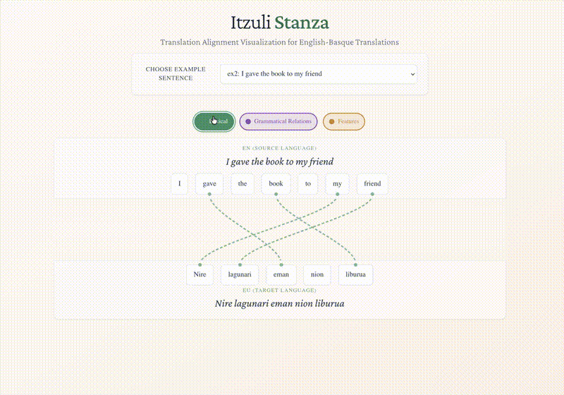

# Itzuli + Stanza NLP Integration

[🇺🇸 English](README.md) | [🔴⚪🟢 Euskera](README.eu.md)

This is a monorepo containing a Basque NLP system that integrates translation and morphological analysis capabilities with a web-based alignment visualization interface.

## Demo



## Project Structure

```text
itzuli-stanza-mcp/
├── backend/           # Python NLP backend with MCP server
└── frontend/          # TypeScript + React alignment visualizer
```

## Components

### Backend

Python-based NLP processing server with:

- Stanza integration for morphological analysis
- Translation alignment algorithms
- MCP (Model Context Protocol) server for Claude integration

### Frontend

React-based visualization interface featuring:

- Interactive alignment visualization with animated ribbons
- Multi-layer alignment support (lexical, morphological, syntactic)
- Token highlighting and pinning functionality
- Real-time data fetching from backend API

## Documentation

For detailed documentation, please see:

- **[Backend README](backend/README.md)** - Python backend documentation
- **[Architecture Documentation](backend/ARCHITECTURE.md)** - Detailed system architecture
